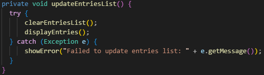
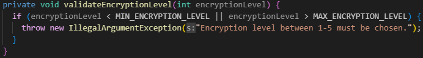
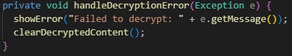
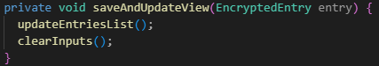
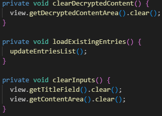
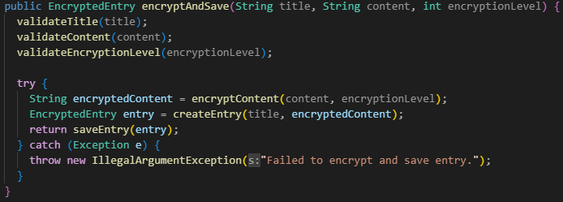

# Reflections L3

## Chapter 2

Chapter 2 of Clean Code is all about creating meaningful names and the importance of good naming conventions. This is, with out a doubt one of the major topics regarding code quality that has affected me. I consider every name I create, dont get me wrong, before i read this book and took this course i had issues coming up with names at all, but thats not the case now. Now the creation of names have become quite easy but the part that requires consideration is `How to get the name as intention revealing and pronouncable as possible` instead. So to wrap this up, naming conventions affect all of my code, from start to finish, to maintenance. 

Examples:
---

---
   
---

---

## Chapter 3

Regarding the rules for funcitons I do agree with them to an extent. For example, `Do one thing` & `One level of abstraction per function`. These two rules are not always appropriate to implement according to me and should be used as a guide line and be strictly applied where possible without creating messy code. Id argue that code can also become a mess with to many well named functions creating an un-ending series of well named functions that you have to follow.

Other rules that affect my way of writing functions are the `DRY` principle, `Prefer Exceptions to Returning Error Codes` and `Small!`, the first two mentioned rules are self explanatory and the code should for the most part adhere to these rules. When it comes to keeping functions small, I try to, but it is simply not always possible to keep them as small as the litterature instructs with out making the code messy, as i mentioned earlier. Code can become messy in more then one way.

When it comes to function arguments, my goal is always to keep as many functions as possible niladic or monadic. It is not always simple to get the code base to that stage on the first try, so there are several occurances of dyadic functions and one single triadic in EncryptionService. Im sure that some consideration and refactoring could break out several of the dyadic functions to monadic.

Examples:

`A short, self explanatory function that does more then one thing.`

---
`Niladic functions doing one or arguably two things`

---
`The one triadic function, this should probably be refactored.`

---

## Chapter 4

_"The proper use of comments is to compensate for our failure to express ourself in code."_

## Chapter 5

## Chapter 6

## Chapter 7

## Chapter 8

## Chapter 9

## Chapter 10

## Chapter 11

## Final & Personal Reflections.

# Reflections Module