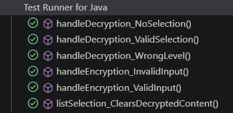
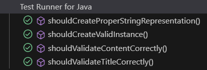
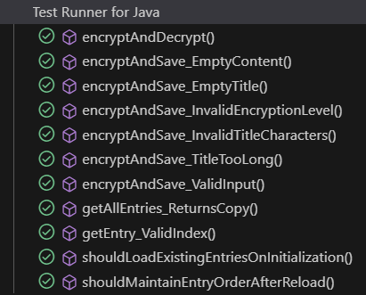
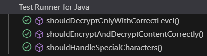
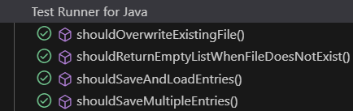
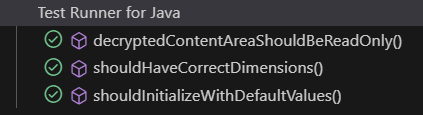
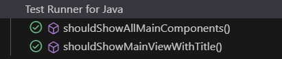

## Test Report

The following images are the results of the automated testing performed for the `SafeStorage` desktop application. 
The testing is automated using Junit 5.7.0. and TestFX 4.0.16, all the tests are included in the repository in the [Test folder.](./src/Test/java/SafeStorage/)

#### EncryptionController class

#### EncryptionEntry class

#### EncryptionService class

#### EncryptionUtil class

#### FileManager class

#### MainView class

#### SafeStorage class

